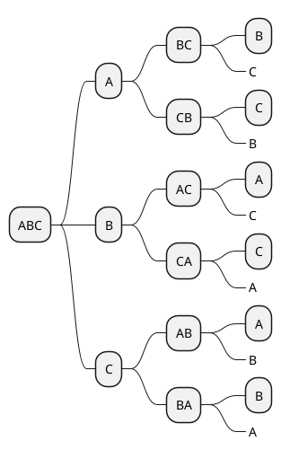

# 条件概率.md

## 经典实例（历史上）

## 开始做

### 1.

## 参考文献及资料

1. 维基百科
	- [Conditional probability](https://en.wikipedia.org/wiki/Conditional_probability) | [条件概率](https://zh.wikipedia.org/wiki/条件概率) 
	- [Prior probability](https://en.wikipedia.org/wiki/Prior_probability) | [先验概率](https://zh.wikipedia.org/wiki/先验概率) 
	- [Posterior probability](https://en.wikipedia.org/wiki/Posterior_probability) | [后验概率](https://zh.wikipedia.org/wiki/后验概率) 